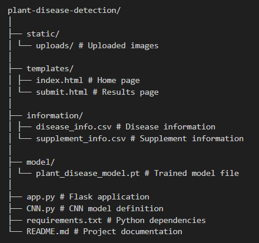
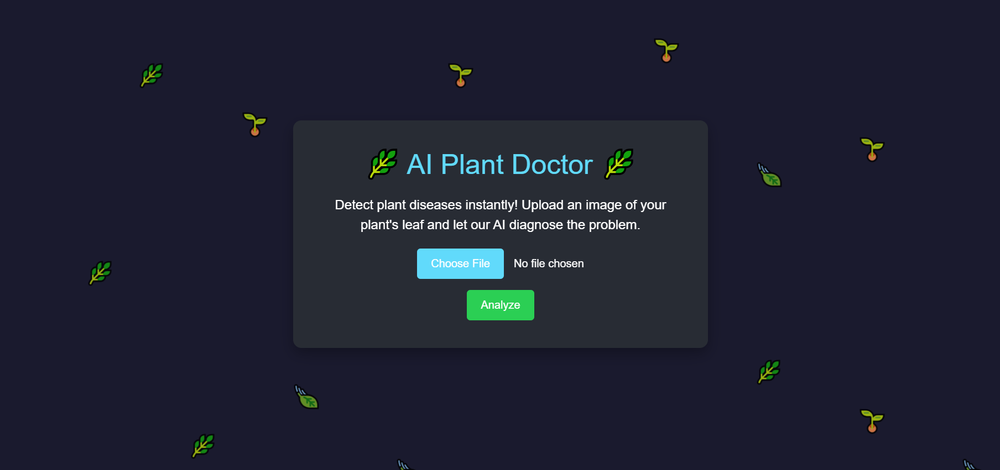
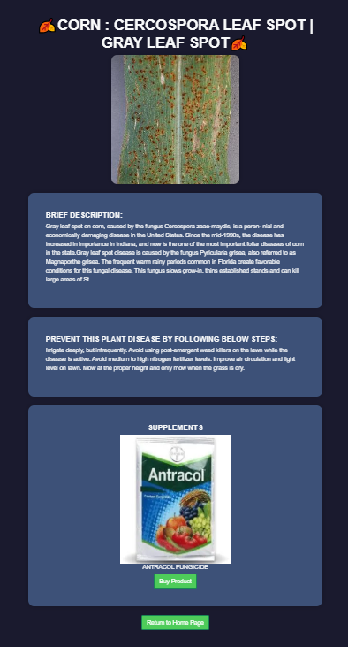

# Flask-based Plant Disease Detection Web-app

This is a Flask web application for detecting plant diseases using a convolutional neural network (CNN) model trained on image data. The application utilizes basic Flask functionality to integrate the model and provide real-time predictions.

## Index

- [Features](#features)
- [Project Structure](#project-structure)
- [Installation](#installation)
- [Usage](#usage)
- [Model and Data](#model-and-data)
- [Screenshots](#screenshots)
- [Known Issues](#known-issues)
- [Future Work](#future-work)
- [Credits](#credits)
- [Contributing](#contributing)
- [Contact](#contact)

## Features

- Upload plant leaf images for disease detection.
- Provides disease description and prevention steps.
- Suggests relevant supplements with purchase links.

## Project Structure


## Installation

1. Clone this repository:
    ```bash
    git clone <repository_url>
    ```

2. Navigate to the project directory:
    ```bash
    cd plant-disease-detection
    ```

3. Install the required dependencies:
    ```bash
    pip install -r requirements.txt
    ```

## Usage

1. Run the Flask application:
    ```bash
    python app.py
    ```

2. Open a web browser and go to [http://127.0.0.1:5000/](http://127.0.0.1:5000/).

3. Upload an image of a plant leaf to detect the disease.

## Model and Data

The CNN model used for disease detection is defined in `CNN.py`. The model is trained on a dataset consisting of images of various plant diseases.

You can find the model training code and details in this repository: [PlantDiseaseClassifier](https://github.com/JayDobariya14/PlantDiseaseClassifier/tree/main). After training the model, save it as `model/plant_disease_model.pt` to use it in the web application.

## Screenshots

Here are screenshots of the web-application:





## Known Issues

- Limited to the plant diseases included in the training dataset.
- Performance may vary based on image quality and conditions.

## Future Work

- Expand the dataset to include more plant diseases.
- Improve the model accuracy with advanced architectures.
- Add user authentication and data storage.

## Credits

- **Dataset**: [PlantVillage Dataset](https://data.mendeley.com/datasets/tywbtsjrjv/1)
- **Model architecture**: Inspired by [VGGNet](https://arxiv.org/abs/1409.1556)
- **Flask web application**: Developed by Jay Dobariya.

## Contributing

Contributions are welcome! Please open an issue or submit a pull request for any feature requests, bug fixes, or improvements.

## Contact

For any questions or feedback, please contact:

Jay Dobariya - dobariyajay2004@gmail.com